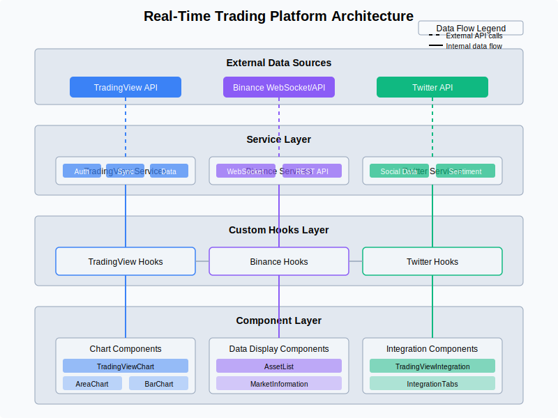
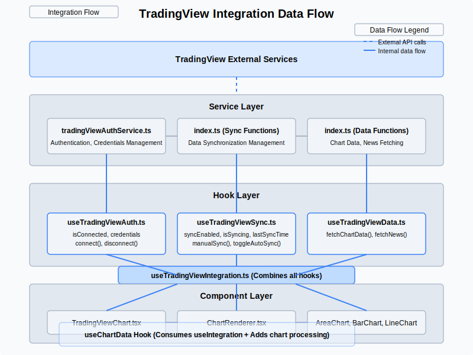
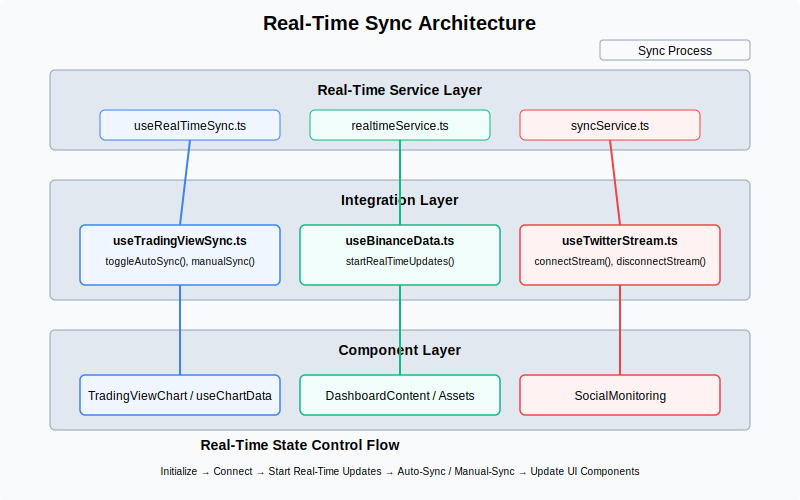

# Architecture Diagrams

This document provides an overview of the architecture diagrams that illustrate the structure and data flow of the Real-Time Trading & Analytics Platform.

## Main Architecture Diagram

This diagram shows the overall architecture of the platform, including:

- External data sources (TradingView, Binance, Twitter)
- Service layer components
- Custom hooks layer
- Component layer with UI elements

The architecture follows a clear separation of concerns, with each layer having specific responsibilities:

1. **External Data Sources Layer**: Interfaces with third-party APIs and services
2. **Service Layer**: Provides core functionality for data retrieval, authentication, and synchronization
3. **Custom Hooks Layer**: React hooks that encapsulate business logic and state management
4. **Component Layer**: UI components that render the data and provide user interaction

## TradingView Integration Flow

This diagram focuses specifically on the TradingView integration, showing:

- Authentication flow
- Data synchronization mechanisms
- Chart data processing
- Component rendering pipeline

The TradingView integration is structured around three main services:
- `tradingViewAuthService.ts`: Manages user authentication and credentials
- `syncService.ts`: Handles real-time data synchronization
- Data services: Fetch chart data and other information

These services are exposed through specialized hooks:
- `useTradingViewAuth`: Authentication state and methods
- `useTradingViewSync`: Synchronization state and controls
- `useTradingViewData`: Data fetching methods

The `useTradingViewIntegration` hook combines all these hooks to provide a unified API for components.

## Real-Time Sync Architecture

This diagram illustrates the real-time synchronization architecture, showing:

- Real-time service layer components
- Integration with different data sources
- Component updates based on real-time data

The real-time sync architecture is built around `useRealTimeSync`, a custom hook that provides:
- Interval-based polling
- WebSocket connection management
- Real-time state updates
- Automatic and manual synchronization control

Each data source (TradingView, Binance, Twitter) has its own integration with the real-time system, allowing for customized behavior while maintaining a consistent approach to real-time updates.

## Data Flow

The data flows through the system as follows:

1. External APIs provide data through REST or WebSocket connections
2. Service layer processes and normalizes this data
3. Custom hooks manage state and provide reactive updates
4. Components render the data and respond to changes

This architecture ensures that:
- Data is consistent across the application
- UI components are updated efficiently
- Real-time updates are handled gracefully
- The system is resilient to connection issues

## Extending the Architecture

To extend this architecture:

1. Add new services for additional data sources
2. Create specialized hooks for those services
3. Integrate with the real-time sync system
4. Create or update components to display the new data

This modular approach allows for easy extension without disrupting existing functionality.
